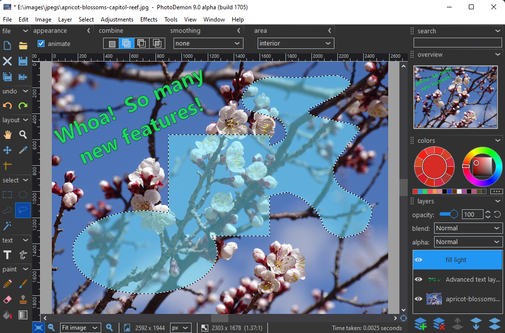

Download
--------

Latest stable release: **<a href="https://github.com/tannerhelland/PhotoDemon/releases/download/v2024.7/PhotoDemon-2024.7.zip">PhotoDemon 2024.7 (zip file, 18.5 mb)</a>** 

For additional downloads, including nightly builds and checksums, [visit the download page](download/).

Overview
--------

PhotoDemon is a free, portable, open-source photo editor for Microsoft Windows.

Its design is guided by three principles:

 **Portability**

PhotoDemon does not require installation, administrator rights, or Internet access.  Its tiny footprint allows it to run directly from USB sticks or SD cards.

 **Power**

The current build provides more than 200 professional-grade tools, including layers, selection tools and digital paintbrushes, content-aware fill and resize, shadow/highlight recovery, perspective and lens correction, and full support for image files from other popular photo editors, including Adobe Photoshop (PSD), Corel Paintshop Pro (PSP), and GIMP (XCF).

 **Usability**

An elegant interface built by designers - not engineers - gets out of the way and lets you work.  [Usability testing](https://en.wikipedia.org/wiki/Usability_testing) drives our design decisions.

Other cool stuff
----------------

PhotoDemon comes with a built-in **macro recorder** and **batch processor**.  Its UI is **fully themable**, with built-in light, dark, and monochrome themes.  All tools support real-time previews, custom presets, keyboard navigation, and unlimited Undo/Redo.

**All Windows versions (XP through Windows 11) are fully supported.**  

**PhotoDemon is available in many languages.**  If your language is missing, <a href="https://photodemon.org/about/contact/">please get in touch</a>.  I would love to support it!