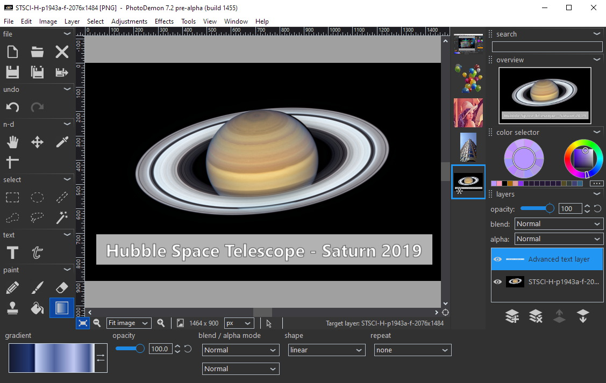

Download
--------

Latest stable release: **<a href="https://github.com/tannerhelland/PhotoDemon/releases/download/v7.0.1/PhotoDemon_7.0.1.zip">PhotoDemon 7.0.1 (zip file, 12.1 mb)</a>** 

For additional downloads, including nightly builds and checksums, [visit the download page](download/).

Overview
--------

PhotoDemon is a free, portable, open-source photo editor for Microsoft Windows.

Its design is guided by three principles:

 **Portability**

PhotoDemon does not require installation, administrator rights, or Internet access.  Its tiny footprint allows it to run directly from USB devices.

 **Power**

The current build provides more than 200 professional-grade tools, including digital darkroom essentials like shadow/highlight recovery, multi-channel curves, content-aware resizing, and HDR.

 **Usability**

An elegant interface built by designers - not engineers - gets out of the way and lets you work.  [Usability testing](https://en.wikipedia.org/wiki/Usability_testing) drives our design decisions.

Other cool stuff
----------------

PhotoDemon comes with a built-in **macro recorder** and **batch processor**.  Its UI is **fully themable**, with built-in light, dark, and monochrome themes.  All tools support real-time previews, custom presets, keyboard nav, and unlimited Undo/Redo.

**All Windows versions (XP through Windows 10) are fully supported.**  

**20+ language translations are currently available.**  If your language is missing, please <a href="https://github.com/tannerhelland/PhotoDemon/issues">let me know</a>.